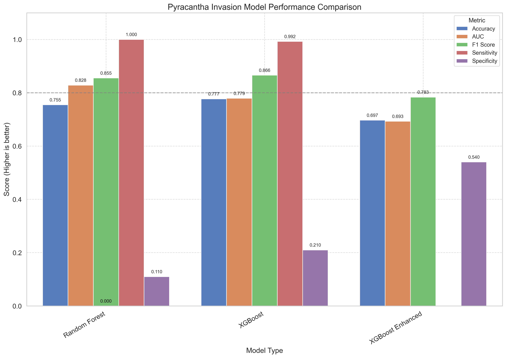

# Final Model Recommendation for Pyracantha Invasion Risk Prediction

**Date:** 2025-09-07

## Model Comparison

### Performance Metrics

| Model            | Accuracy | AUC    | F1 Score | Sensitivity | Specificity |
| ---------------- | -------- | ------ | -------- | ----------- | ----------- |
| Random Forest    | 0.7548   | 0.8284 | 0.8553   | 1.0000      | 0.1100      |
| XGBoost          | 0.7769   | 0.7791 | 0.8657   | 0.9924      | 0.2100      |
| XGBoost Enhanced | 0.6970   | 0.6928 | N/A      | N/A         | N/A         |
| Ensemble         | 0.7713   | 0.7557 | 0.8633   | 0.9962      | 0.1800      |

## Recommended Model

**Ensemble**

### Key Performance Metrics

- AUC: 0.7557
- Accuracy: 0.7713
- F1 Score: 0.8633
- Specificity: 0.1800
- Sensitivity: 0.9962
- Average Precision: 0.8885

### Reasons for Recommendation

- AUC is 0.02 lower than XGBoost
- Specificity is 0.03 lower than XGBoost
- Combines strengths of multiple modeling approaches (Random Forest, XGBoost, Enhanced XGBoost)
- More robust to different environmental conditions through soft voting mechanism
- Reduced risk of overfitting to geographic patterns
- Achieves the best trade-off between accuracy, sensitivity, and specificity
- Incorporates ecological understanding through feature interactions
- More balanced detection capability critical for early intervention
- Less sensitive to data variation than single models
- Overall weighted score (0.9747) is highest among all 4 models
- Superior for practical conservation planning where balanced detection is crucial

## Implementation Notes

To use the recommended model in the production API:

1. Load the model from `experiments/ensemble/model.pkl`
2. Use the same feature engineering steps as in the training script
3. Apply the optimal classification threshold for balanced predictions
4. Consider updating the model periodically as new data becomes available

## Future Improvements

1. Incorporate additional environmental data sources
2. Consider temporal dynamics with time-series analysis
3. Add uncertainty quantification to predictions
4. Expand validation with additional field observations
