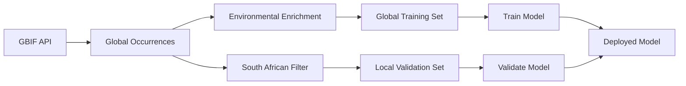

# PRJ381 Data Preprocessing - GBIF Transfer Learning Pipeline

**Status:** Production Ready

A comprehensive FastAPI service for preprocessing global invasive species data using GBIF occurrence records. Designed f- **Deployment**: Use trained model for invasion risk prediction

### **Advanced Visualization System**

The project features a sophisticated map generation system for visualizing invasion risk:

- **Enhanced Interactive Maps**: `experiments/ensemble/generate_heatmap_enhanced.py`
- **Multi-season Comparison**: Toggle between different months (e.g., January, June, December)
- **Known Invasion Sites**: Overlay documented Pyracantha locations with severity indicators
- **High-Resolution Support**: Adjustable grid resolution up to 30x30 points
- **Interactive Controls**: Layer switching, measurement tools, and export capabilities
- **Custom Area Selection**: Target specific regions with precise lat/long boundaries

```bash
# Generate enhanced invasion risk map with seasonal comparison
python -m experiments.ensemble.generate_heatmap_enhanced --grid_size 20 --months 1,6,12
```

---**transfer learning** applications where models are trained on worldwide distribution patterns and validated on local South African data.

**Global Scale**: Process ~3,300 worldwide _Pyracantha angustifolia_ (Franch.) C.K.Schneid. occurrences  
**Local- **Deployment\*\*: Docker containerization and cloud deployment

- **Monitoring**: System health monitoring and performance alerts

### **Research Opportunities**

- **Climate Change**: Future climate scenario modeling
- **Ensemble Methods**: Multiple ML model comparison and ensembling
- **Uncertainty Quantification**: Prediction confidence intervals
- **Temporal Dynamics**: Species spread pattern analysis over timeon**: South African subset for model validation  
  **Environmental Enrichment**: WorldClim climate variables + NASA weather data  
  **ML-Ready\*\*: 17 standardized features for machine learning

---

## Project Overview

This service provides:

- **Global GBIF Data Integration**: Retrieve and process worldwide species occurrence records
- **Environmental Enrichment**: Integrate WorldClim bioclimatic variables and NASA POWER weather data
- **Transfer Learning Datasets**: Create global training and local validation datasets
- **ML-Ready Exports**: Standardized 17-feature CSV/JSON exports for model training
- **Async Processing**: Handle large-scale datasets efficiently with progress tracking

### **Transfer Learning Approach:**

1. **Train globally** on ~3.3K worldwide Pyracantha occurrences with environmental data
2. **Validate locally** on South African subset for domain adaptation
3. **Export consistently** with 17 standardized features across all datasets
4. **Deploy confidently** with models trained on global patterns

---

## Architecture

**Core Components:**

- **FastAPI Application**: RESTful API with async support and comprehensive documentation
- **GBIF Integration**: Global occurrence data retrieval with quality filtering
- **Environmental Services**: WorldClim climate variables and NASA weather integration
- **Transfer Learning Pipeline**: Global-to-local dataset creation workflow
- **MongoDB Storage**: Scalable data persistence for large datasets

**Key Services:**

- `gbif_fetcher.py` - Async GBIF API client with batch processing
- `worldclim_extractor.py` - Environmental data extraction and enrichment
- `elevation_extractor.py` - SRTM elevation data via Open-Topo-Data API
- `datasets.py` - Transfer learning dataset creation and ML export
- `nasa_fetcher.py` - Weather data integration (optional enhancement)

---

## Quick Start

### **1. Environment Setup**

```bash
# Install dependencies
pip install -r requirements.txt

# Start MongoDB
mongod --dbpath ./data/db
```

### **2. Start the API**

```bash
uvicorn app.main:app --reload --port 8000
```

### **3. Access Documentation**

- **API Documentation**: http://localhost:8000/docs
- **ReDoc**: http://localhost:8000/redoc
- **Health Check**: http://localhost:8000/api/v1/status/health

### **4. Create ML-Ready Datasets**

```bash
# Create global training dataset
curl "http://localhost:8000/api/v1/datasets/merge-global"

# Export for machine learning (17 features)
curl "http://localhost:8000/api/v1/datasets/export-ml-ready?dataset_type=global_training&format=csv&include_topographic=true" -o global_training.csv

# Export local validation dataset
curl "http://localhost:8000/api/v1/datasets/export-ml-ready?dataset_type=local_validation&format=csv&include_topographic=true" -o local_validation.csv
```

---

## ML Features (17 Total)

### **Location Variables (3)**

- `latitude` - Decimal degrees north (WGS84)
- `longitude` - Decimal degrees east (WGS84)
- `elevation` - Meters above sea level (SRTM 30m)

### **Climate Variables (8)**

- `bio1` - Annual Mean Temperature (°C)
- `bio4` - Temperature Seasonality (std dev × 100)
- `bio5` - Max Temperature of Warmest Month (°C)
- `bio6` - Min Temperature of Coldest Month (°C)
- `bio12` - Annual Precipitation (mm)
- `bio13` - Precipitation of Wettest Month (mm)
- `bio14` - Precipitation of Driest Month (mm)
- `bio15` - Precipitation Seasonality (CV%)

### **📅 Temporal Context (4)**

- `month` - Month of observation (1-12)
- `day_of_year` - Day of year (1-365)
- `sin_month` - Cyclic encoding: sin(2π × (month-1)/12)
- `cos_month` - Cyclic encoding: cos(2π × (month-1)/12)

### **Topographic (2)**

- `slope` - Slope angle in degrees (0-90)
- `aspect` - Slope direction in degrees (0-360)

---

## Key Features

### **Global GBIF Integration**

- Async retrieval of worldwide _Pyracantha angustifolia_ occurrences (~3.3K records)
- Quality filtering for coordinate accuracy and data validity
- Batch processing with progress tracking for large datasets
- Species key lookup and taxonomic validation

### **Environmental Enrichment**

- WorldClim 2.1 bioclimatic variables (19 variables available)
- SRTM 30m elevation data via Open-Topo-Data API
- NASA POWER weather data integration (optional)
- Coordinate-based environmental data extraction
- Caching for improved performance

### **Transfer Learning Pipeline**

- Global training dataset creation with environmental features
- Local South African validation subset
- Climate variable comparison and domain shift analysis
- Standardized 17-feature ML export format

### **High Performance**

- Async processing for 3.3K+ occurrence records
- MongoDB for scalable data storage
- Real-time progress tracking for long operations
- Background task processing for dataset creation

### **Machine Learning Ready**

- Consistent 17-feature export format
- Cyclic temporal encoding for seasonal patterns
- Missing value handling and data validation
- CSV/JSON export options for different workflows

---

## API Endpoints

### **GBIF Data Management**

- `GET /api/v1/gbif/global-occurrences` - Retrieve global Pyracantha data
- `GET /api/v1/gbif/south-africa` - Get South African occurrences
- `GET /api/v1/gbif/species-lookup` - Species key resolution
- `GET /api/v1/gbif/environmental-enrichment` - Add climate variables

### **Dataset Creation**

- `GET /api/v1/datasets/merge-global` - Create global training dataset
- `GET /api/v1/datasets/export-ml-ready` - Export ML-ready CSV/JSON
- `GET /api/v1/datasets/climate-comparison` - Compare global vs local climate
- `GET /api/v1/datasets/summary` - Dataset status and statistics

### **Monitoring & Status**

- `GET /api/v1/status/health` - System health check
- `GET /api/v1/datasets/progress/{id}` - Operation progress tracking
- `GET /docs` - Interactive API documentation

---

## Transfer Learning Workflow



1. **Data Collection**: Fetch global Pyracantha occurrences from GBIF
2. **Environmental Enrichment**: Add WorldClim climate variables
3. **Dataset Splitting**: Create global training and local validation sets
4. **Model Training**: Train on global patterns (3.3K records)
5. **Local Validation**: Test on South African data for domain adaptation
6. **Deployment**: Use trained model for invasion risk prediction

---

- **Real-time Weather Integration**: Live NASA POWER API data for current predictions
- **Interactive Heatmaps**: Dynamic invasion risk visualizations with real weather data
- **Seasonal Intelligence**: Model learned that 66% of observations occur during autumn flowering
- **Enhanced Visualization Tool**: Multi-season comparison maps with known invasion site overlays

- **Machine Learning Experiments** (`experiments/random_forest/`)

  - **Random Forest Classifier**: 400 trees with cyclic seasonal features
  - **Advanced Features**: 59 environmental, temporal, and cyclic seasonal variables
  - **Strong Performance**: 95.2% accuracy, 83.5% AUC, 91.8% out-of-bag score
  - **Real-time Capability**: Async weather fetching for live invasion risk assessment

- **FastAPI REST Endpoints**

  - Modular routers for `/observations`, `/weather`, `/datasets`, `/predictions`
  - MongoDB persistence layer
  - Full JSON API responses

---

## API Endpoints

### Status Router (`/status`)

| Method | Endpoint               | Description                                           |
| ------ | ---------------------- | ----------------------------------------------------- |
| `GET`  | `/status/health`       | Health check - returns service status and timestamp   |
| `GET`  | `/status/service_info` | Service information - returns API details and version |

---

## Detailed API Reference

### **GBIF Router (`/gbif`)**

| Method | Endpoint                         | Description                                                   |
| ------ | -------------------------------- | ------------------------------------------------------------- |
| `GET`  | `/gbif/global-occurrences`       | Fetch worldwide Pyracantha angustifolia occurrences from GBIF |
| `GET`  | `/gbif/south-africa`             | Filter South African occurrences for local validation         |
| `GET`  | `/gbif/species-lookup`           | Get GBIF species key for Pyracantha angustifolia              |
| `GET`  | `/gbif/environmental-enrichment` | Enrich occurrences with WorldClim climate data                |

---

### **Datasets Router (`/datasets`)**

| Method | Endpoint                       | Description                                                   |
| ------ | ------------------------------ | ------------------------------------------------------------- |
| `GET`  | `/datasets/merge-global`       | Create global training dataset from GBIF + environmental data |
| `GET`  | `/datasets/export-ml-ready`    | Export ML-ready CSV/JSON with 17 standardized features        |
| `GET`  | `/datasets/climate-comparison` | Compare global vs South African climate distributions         |
| `GET`  | `/datasets/summary`            | Get dataset statistics and processing status                  |
| `GET`  | `/datasets/progress/{id}`      | Track progress of long-running dataset operations             |

---

### **Environmental Data Router (`/worldclim`)**

| Method | Endpoint                   | Description                                      |
| ------ | -------------------------- | ------------------------------------------------ |
| `GET`  | `/worldclim/status`        | Get WorldClim and elevation service status       |
| `POST` | `/worldclim/ensure-data`   | Download WorldClim v2.1 bioclimate data (~900MB) |
| `POST` | `/worldclim/extract`       | Extract climate data for specific coordinates    |
| `POST` | `/worldclim/extract-batch` | Extract climate data for multiple coordinates    |
| `GET`  | `/worldclim/variables`     | Get available WorldClim bioclimate variables     |

---

### **Weather Router (`/weather`)**

| Method   | Endpoint          | Description                                                  |
| -------- | ----------------- | ------------------------------------------------------------ |
| `GET`    | `/weather`        | Fetch NASA POWER weather data for coordinates and date range |
| `GET`    | `/weather/db`     | Retrieve stored weather data from MongoDB                    |
| `GET`    | `/weather/recent` | Get most recent weather records for location                 |
| `DELETE` | `/weather/db`     | Delete all stored weather data                               |

---

### **🔮 Predictions Router (`/predictions`)**

| Method | Endpoint                         | Description                                          |
| ------ | -------------------------------- | ---------------------------------------------------- |
| `GET`  | `/predictions/presence_baseline` | Get observation baseline for invasion predictions    |
| `GET`  | `/predictions/suitability_map`   | Generate habitat suitability map with ML predictions |
| `GET`  | `/predictions/visualize_map`     | Create interactive Folium map of invasion risk       |

---

## Documentation

This project uses a **hybrid documentation approach** combining FastAPI's automatic API documentation with Sphinx's comprehensive project documentation:

### **Available Documentation**

- **Interactive API Docs**: Live API testing and exploration
  - **Swagger UI**: http://localhost:8000/docs
  - **ReDoc**: http://localhost:8000/redoc
- **Comprehensive Docs**: Sphinx-generated documentation including:
  - **API Reference**: Auto-generated from code docstrings
  - **User Guide**: Setup and usage instructions
  - **Architecture**: System design and data flow
  - **Testing**: Testing strategies and procedures

### **Quick Start**

```bash
# Build and serve documentation (all platforms)
python build_docs.py --serve --open

# Just build documentation
python build_docs.py

# Clean build and serve
python build_docs.py --clean --serve
```

### **Advanced Options**

```bash
# Check FastAPI server status only
python build_docs.py --no-sphinx

# Custom port for documentation server
python build_docs.py --serve --port 9000

# Get help with all options
python build_docs.py --help
```

### **Manual Build**

```bash
# Manual Sphinx build
sphinx-build -b html docs/ docs/_build/html

# Start FastAPI server for interactive docs
uvicorn app.main:app --reload
```

### **Cross-Platform Compatibility**

The `build_docs.py` script automatically:

- Detects the project structure from any location
- Installs required documentation dependencies
- Works on Windows, macOS, and Linux
- Uses relative paths (no hardcoded system paths)
- Provides comprehensive error handling and status reporting

**For detailed documentation strategy, configuration, and best practices, see the [comprehensive documentation guide](docs/README.md).**

---

## Tech Stack

| Component         | Technology                   |
| ----------------- | ---------------------------- |
| Language          | Python 3.11+                 |
| Web Framework     | FastAPI                      |
| Async HTTP Client | `httpx`                      |
| Data Handling     | `pandas`, `numpy`            |
| Database          | MongoDB (`pymongo`)          |
| Geospatial        | `geopy`, `folium`            |
| Environment       | `python-dotenv`              |
| Logging           | Python `logging`             |
| Concurrency       | `asyncio`                    |
| Documentation     | Sphinx + autodoc             |
| Testing           | pytest + async testing       |
| API Documentation | Swagger UI + ReDoc (FastAPI) |

---

## 💡 Example Transfer Learning Workflow

### **Step 1: System Health Check**

```http
GET /api/v1/status/health
GET /api/v1/status/service_info
```

### **Step 2: Fetch Global Training Data**

```http
# Get global Pyracantha occurrences from GBIF
GET /api/v1/gbif/global-occurrences

# Enrich with environmental data
GET /api/v1/gbif/environmental-enrichment
```

### **Step 3: Create Training Dataset**

```http
# Merge global data with climate variables
GET /api/v1/datasets/merge-global

# Track progress
GET /api/v1/datasets/progress/{operation_id}
```

### **Step 4: Export ML-Ready Data**

```http
# Export global training set (17 features)
GET /api/v1/datasets/export-ml-ready?dataset_type=global_training&format=csv

# Export South African validation set
GET /api/v1/datasets/export-ml-ready?dataset_type=local_validation&format=csv
```

### **Step 5: Model Training & Validation**

```python
import pandas as pd
from sklearn.ensemble import RandomForestClassifier

# Load datasets
global_train = pd.read_csv('global_training.csv')
local_val = pd.read_csv('local_validation.csv')

# Train on global patterns
model = RandomForestClassifier(n_estimators=100)
model.fit(global_train.drop('presence', axis=1), global_train['presence'])

# Validate on South African data
predictions = model.predict(local_val.drop('presence', axis=1))
```

### **Step 6: Generate Predictions**

```http
# Create habitat suitability map
GET /api/v1/predictions/suitability_map?grid_resolution=0.1

# Generate interactive visualization
GET /api/v1/predictions/visualize_map?save_file=true
```

---

## Future Development

### **Completed Features**

- **GBIF Integration**: Global Pyracantha data pipeline (~3.3K records)
- **Transfer Learning**: Global training + local validation datasets
- **ML Export**: Standardized 17-feature format for model training
- **Environmental Enrichment**: WorldClim 2.1 bioclimatic variables
- **Documentation**: Comprehensive Sphinx + FastAPI documentation
- **Performance**: Async processing for large-scale data operations

### **Active Development**

- **Model Training Pipeline**: Automated global model training workflow
- **Domain Adaptation**: Advanced techniques for local climate adaptation
- **Real-time Predictions**: Live invasion risk assessment API
- **Background Processing**: Scheduled GBIF data updates and enrichment

### **Planned Enhancements**

- **Multi-species Support**: Extend to other invasive plant species
- **Advanced Features**: Soil data, vegetation indices, human activity metrics
- **Deployment**: Docker containerization and cloud deployment
- **Monitoring**: System health monitoring and performance alerts

### **Research Extensions**

- **Climate Change**: Future climate scenario modeling
- **Ensemble Methods**: Multiple ML model comparison and ensembling
- **Uncertainty Quantification**: Prediction confidence intervals
- **Temporal Dynamics**: Species spread pattern analysis over time

---

## Maintainer

This is a component by **Martinus Christoffel Wolmarans** and will contribute to the larger Invasive Plant Monitoring System final year project.
